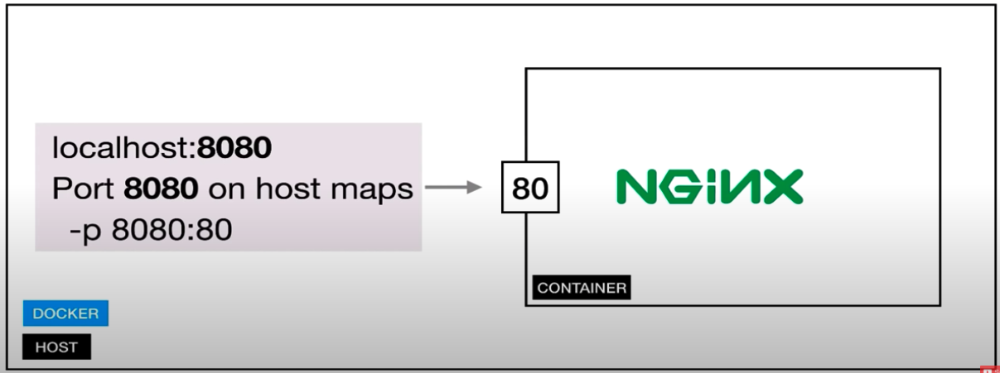
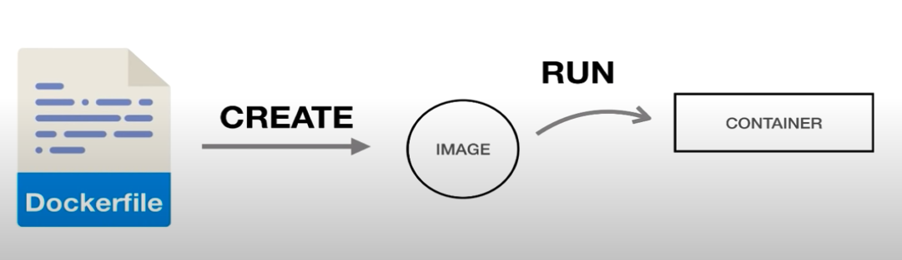

# Docker Image 

Image is a template for creating an environmet of your choice.
Image is also a snapshot.
Image contains OS, Software and App Code

# Container

Running instance of an container.

# Docker - Expose Port 

# Docker Volumes
1. Allow sharing of data. Files and Folders
2. Between host and container
3. Between containers

# Dockerfile 

Build own images

# Docker Registries

1. Highly scalable server side application that stores and lets you distribute Docker images.
2. Used n your CD/CI pipeline
3. Run your applications
4. Examples- Docker Hub, quay.io and Amazon ECR

# Docker Security - Extra Resources

OWASP Docker Top 10

https://owasp.org/www-project-docker-top-10/

10 Docker Best Security Practices

https://snyk.io/blog/10-docker-image-security-best-practices/

Docker Security Cheat Sheet

https://cheatsheetseries.owasp.org/cheatsheets/Docker_Security_Cheat_Sheet.html

Docker Security

https://docs.docker.com/engine/security/

## docker system prune

This will remove:
    - all stopped contianers
    - all networks not used by at least one container
    - all dangling images
    - all dangling build cache